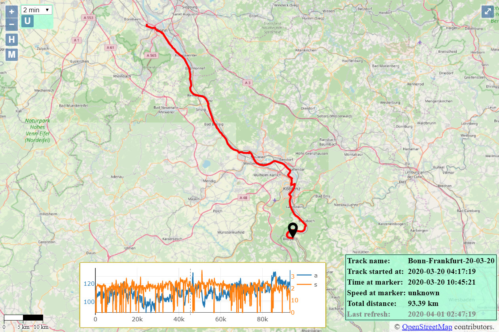

**[OsmAnd](https://github.com/osmandapp/Osmand) Live Tracking Front- & Backend App**

OsmAnd is a powerful navigation application. Android version contains*Trip recording* plugin, which allows storing tracks as GPX-files as well as posting current GPS-data to remote server.

##Prerequisites
In order to make this code work, you will need a web server. You can use either web-server on your local machine (e.g. [WampServer](http://www.wampserver.com/en/) or [LightTPD](https://www.lighttpd.net/)) or on virtual server (e.g. [DigitalOcean Droplet](https://www.digitalocean.com/)), or any other web-hosting (e.g. free [000webhost](https://www.000webhost.com/)).

The key requirements are:
1. PHP support
2. Database support (e.g. MySQL)

####Additional libraries
The following additional libraries are used:
1. [OpenLayers](https://openlayers.org/) for dynamic map implementation.
2. [Plotly.JS](https://plotly.com/javascript/) for dynamic graph visualization

However, you don't need to download anything. Online versions of libraries are used.

##Screenshot


##Getting Started
All necessary files are located in *v2.1/* folder.
1. Just get the content of repo using `git clone https://github.com/ilyko96/osmand-live-tracker.git`.
2. Get access to database. You will need 4 database values:
    * Database name
    * Username
    * Password
    * Host (usually equals to `localhost`)
3. Fill your data in *configuration.php*. Make up your own `$secretKey`.
4. Rename file *configuration.php* to *configuration_my.php*
4. Log in to phpMyAdmin and create 2 tables:
```sql
CREATE TABLE `osmand_tracks` (
    `uid` int(11) NOT NULL AUTO_INCREMENT,
    `name` varchar(128) COLLATE utf8_unicode_ci NOT NULL UNIQUE,
    `from_lon` float DEFAULT NULL,
    `from_lat` float DEFAULT NULL,
    `to_lon` float DEFAULT NULL,
    `to_lat` float DEFAULT NULL,
    PRIMARY KEY (`uid`)
) ENGINE=InnoDB DEFAULT CHARSET=utf8 COLLATE=utf8_unicode_ci;
```
```sql
CREATE TABLE `osmand_online` (
    `uid` int(11) NOT NULL AUTO_INCREMENT,
    `timestamp_server` timestamp NOT NULL DEFAULT current_timestamp(),
    `timestamp_log` timestamp NOT NULL DEFAULT '0000-00-00 00:00:00',
    `lat` float NOT NULL,
    `lon` float NOT NULL,
    `hdop` float DEFAULT NULL,
    `altitude` float DEFAULT NULL,
    `speed` float DEFAULT NULL,
    `sender` varchar(256) COLLATE utf8_unicode_ci DEFAULT NULL,
    `track_uid` int(11) NOT NULL,
    PRIMARY KEY (`uid`),
    CONSTRAINT `fk_track` FOREIGN KEY (`track_uid`) REFERENCES `osmand_tracks` (`uid`)
   ) ENGINE=InnoDB DEFAULT CHARSET=utf8 COLLATE=utf8_unicode_ci;
```
Of course, you are not limited by phpMyAdmin. Please, use your favorite way to create SQL tables.

6. Upload files to web-server.
7. Set up your OsmAnd navigator to post your GPS-data
    * Go to *Settings => Plugins => Trip recording => Settings => Online tracking web address* and add URL to your web-server in the following format: 
```
url_to_your_web.server/track.php?lat={0}&lon={1}&timestamp={2}&hdop={3}&altitude={4}&speed={5}&bearing={6}&key=YOURKEY&sender=YOURNAME&track=TRACKNAME
```
8. Turn on GPS logging and *Online tracking* and wait until some data is got stored in Database
9. Navigate to `url_to_your_web.server/index.html`
10. Enjoy!

##Troubleshooting
> No data is being stored in DB

Try to navigate to the URL from 7. manually using browser (and making some fake data), and check the response. Usually you can see what is wrong there.

> It just does not work

Try to get what part is broken and google it. If google does not help, open an issue and I will try to help. 